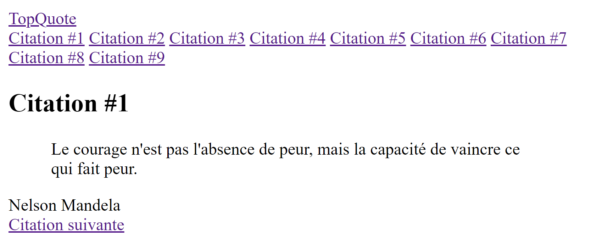
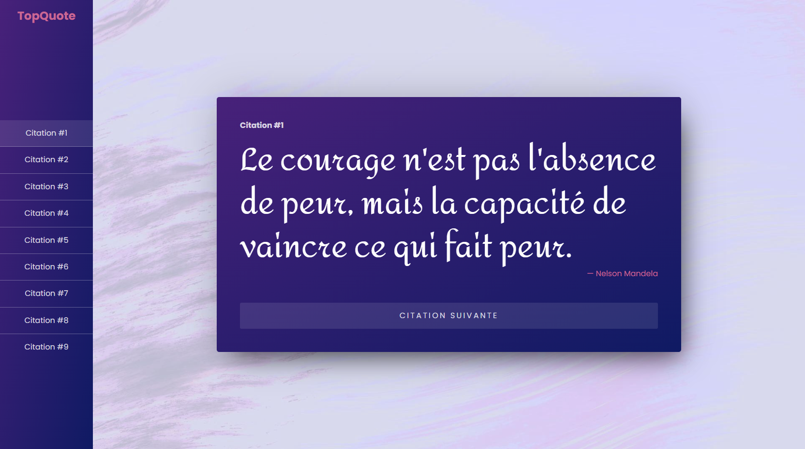

# TopiQuote

On a récupéré une base de projet quasi vide, on a le bundler Parcel en place avec un `index.html` quasi vide. Une feuille de styles SASS est également présente incluant juste un reset mais elle n'est pas utilisée.

Notre objectif va être de construire un mini-site composé de plusieurs pages. Chaque page présentera une citation célèbre.

## Etape 1 : structure HTML d'une page type

Créer une structure HTML cohérente dans le fichier `index.html`.

Elle doit présenter la citation suivante : 

> Le courage n'est pas l'absence de peur, mais la capacité de vaincre ce qui fait peur.  
> — Nelson Mandela

On doit également trouver 

- le nom du site qui recharge la page de la première citation
- un menu qui contiendra par la suite des liens vers les autres citations
- un lien pour passer à la citation suivantes quand on l'aura mis en place à l'étape suivante

Cela doit donner quelque comme ça

## Etape 2 : déclinaison en plusieurs pages

### A

Une fois satisfait de la structure de cette première page on va devoir en créer 8 supplémentaires exactement sur le même modèle mais avec des citations différentes, voici les 8 citations :

> La beauté est dans les yeux de celui qui regarde.
> Oscar Wilde

> Fais de ta vie un rêve, et d'un rêve, une réalité.
> Antoine de Saint-Exupéry

> L'imagination est plus importante que le savoir.
> Albert Einstein

> La musique est la langue des émotions.
> Emmanuel Kant

> Pas trop d'isolement ; pas trop de relations ; le juste milieu, voilà la sagesse.
> Confucius

> Le premier savoir est le savoir de mon ignorance : c'est le début de l'intelligence.
> Socrate

> Dans la vie, rien n'est à craindre, tout est à comprendre.
> Marie Curie

> L'intelligence, c'est pas sorcier, il suffit de penser à une connerie et de dire l'inverse.
> Coluche

### B

Tire une conclusion de tout ces copier/coller. Est-ce pratique et viable à grande échelle ?

Sans le mettre en place, avec tes connaissances actuelles disposerais-tu d'une solution alternative ? Serait-elle aussi viable à grande échelle ?

## Etape 3 : mise en ligne

### A

On va essayer d'utiliser une solution comme [Vercel](https://vercel.com/) pour mettre en ligne notre site sur le web.

### B

Faisons un point ensemble pour tirer une conclusion sur notre progression.

## Etape 4 : mise en forme

S'il te reste du temps essaye de faire une mise en forme se rapprochant de ce résultat :

Quelques informations : 

- L'image d'arrière plan est disponible dans le dossier `docs` sous le nom `background.jpg`
- La police utilisé pour le texte est `Poppins` et celle pour les citations `Amita`. La balise `link` pour appeler google font est déjà en place dans le html
- Des variables CSS sont en place dans `global.scss` pour le dégradé, le rose et la couleur du texte

## Etape 5 : interactions

Si vraiment tu es en avances on va rendre le site plus ludique. On ne va pas afficher le nom de l'auteur de la citation quand on arrive. A la place on met un bouton _"Révéler l'auteur"_. Quand on clique dessus le nom de l'auteur apparait.

## Aller plus loin

N'hésite pas à customiser le projet selon ton imagination.
